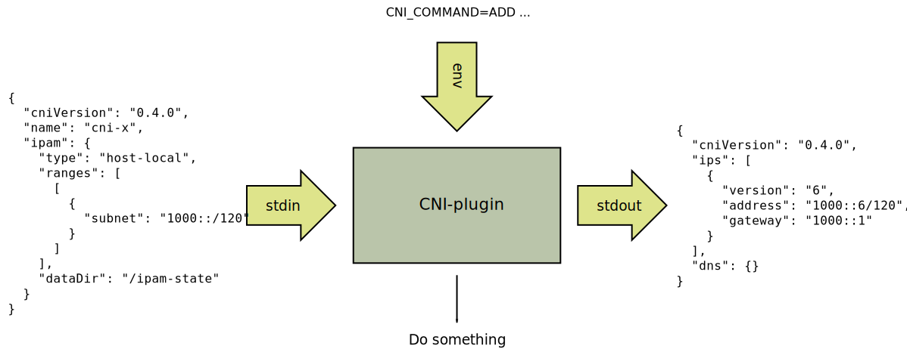

## Container Network Interface (CNI)

General information about the CNI.

First it should be noted that
[CNI](https://github.com/containernetworking/cni) is not a part of
K8s. K8s is one user of CNI and CNI-plugins among others.

The [CNI](https://github.com/containernetworking/cni) is well
documented with lots of examples. You should read the
[SPEC](https://github.com/containernetworking/cni/blob/master/SPEC.md),
at least the "Overview" and "General considerations".

A CNI-plugin reads configuration from *stdin* and takes parameters
form environment variables. It then does something CNI-plugin specific
and emits the result on *stdout*. Configuration and result is in
`json` format;




### Try yourself

Download and unpack a CNI-plugin
[release](https://github.com/containernetworking/plugins/releases);

```
CNIXDIR=$HOME/tmp/cni-experiments
mkdir -p $CNIXDIR
cd $CNIXDIR
tar xf $HOME/Downloads/cni-plugins-linux-amd64-v1.1.1.tgz
```

#### host-local

Use the `host-local` IPAM plugin to get some addresses;

```
CNI_CONTAINERID=$(uuid) CNI_NETNS=None CNI_IFNAME=None CNI_PATH=/ \
CNI_COMMAND=ADD ./host-local <<EOF | jq
{
  "cniVersion": "0.4.0",
  "name": "cni-x",
  "ipam": {
    "type": "host-local",
    "ranges": [
      [
        {
          "subnet": "1000::/120"
        }
      ]
    ],
    "dataDir": "$CNIXDIR/container-ipam-state"
  }
}
EOF
```

Try this a couple of times and examine the `container-ipam-state`
directory. You can experiment with different commands and configurations.


#### bridge

To try a CNI-plugin (not an IPAM) we need a network namespace (netns).
Note that a "netns" is a "partial container", your fs, pid (etc)
namespaces are not altered.

Create a netns, "root" privileges are assumed;

```
# ip netns add cni-x
# ip netns exec cni-x ip link
1: lo: <LOOPBACK> mtu 65536 qdisc noop state DOWN mode DEFAULT group default qlen 1000
    link/loopback 00:00:00:00:00:00 brd 00:00:00:00:00:00
```

The new netns contains only a loopback interface which is "DOWN".

Use the `bridge` CNI-plugin to create an interface in the netns
("root" assumed);

```
# CNIXDIR=/home/<your-user>/tmp/cni-experiments
# cd $CNIXDIR
# CNI_CONTAINERID=$(uuid) CNI_NETNS=/var/run/netns/cni-x CNI_IFNAME=eth0 \
 CNI_PATH=$CNIXDIR CNI_COMMAND=ADD ./bridge <<EOF | jq
{
  "cniVersion": "0.4.0",
  "name": "cni-x",
  "type": "bridge",
  "bridge": "cbr0",
  "isDefaultGateway": true,
  "ipam": {
    "type": "host-local",
    "ranges": [
      [
        {
          "subnet": "1000::/120"
        }
      ]
    ],
    "dataDir": "$CNIXDIR/container-ipam-state"
  }
}
EOF
# ip netns exec cni-x ifconfig
eth0: flags=4163<UP,BROADCAST,RUNNING,MULTICAST>  mtu 1500
        inet6 fe80::f4be:acff:fe8f:6f4  prefixlen 64  scopeid 0x20<link>
        inet6 1000::7  prefixlen 120  scopeid 0x0<global>
        ether f6:be:ac:8f:06:f4  txqueuelen 0  (Ethernet)
        RX packets 12  bytes 1392 (1.3 KB)
        RX errors 0  dropped 0  overruns 0  frame 0
        TX packets 14  bytes 1192 (1.1 KB)
        TX errors 0  dropped 0 overruns 0  carrier 0  collisions 0
# ping -c1 1000::7
PING 1000::7(1000::7) 56 data bytes
64 bytes from 1000::7: icmp_seq=1 ttl=64 time=0.185 ms

--- 1000::7 ping statistics ---
1 packets transmitted, 1 received, 0% packet loss, time 0ms
rtt min/avg/max/mdev = 0.185/0.185/0.185/0.000 ms

# ip netns exec cni-x bash
## (check things...)
# exit
```


Clean-up ("root" assumed);

```
# CNI_CONTAINERID=$(cat ./container-ipam-state/cni-x/1000::7) \
 CNI_NETNS=/var/run/netns/cni-x CNI_IFNAME=eth0 \
 CNI_PATH=$CNIXDIR CNI_COMMAND=DEL ./bridge <<EOF | jq
{
  "cniVersion": "0.4.0",
  "name": "cni-x",
  "type": "bridge",
  "bridge": "cbr0",
  "isDefaultGateway": true,
  "ipam": {
    "type": "host-local",
    "ranges": [
      [
        {
          "subnet": "1000::/120"
        }
      ]
    ],
    "dataDir": "$CNIXDIR/container-ipam-state"
  }
}
EOF
# ip netns del cni-x
# ip link del cbr0
```

