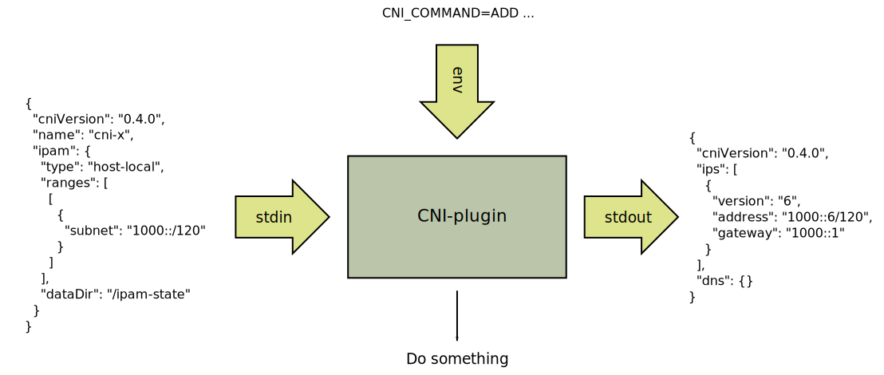
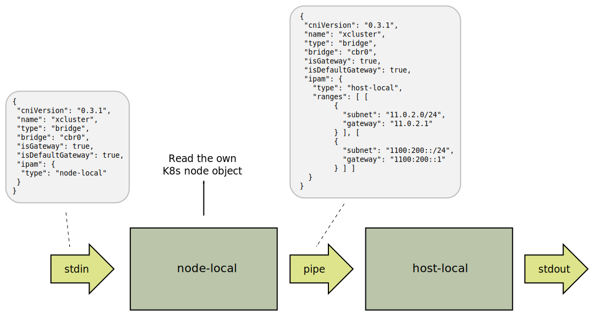

# xcluster-cni

A basic [Kubernetes](https://kubernetes.io/) CNI-plugin.

This is a basic CNI-plugin used in
[xcluster](https://github.com/Nordix/xcluster). The `xcluster-cni` is
a very simple CNI-plugin which makes it suitable for experiments and
as an introduction to container networking in Kubernetes.

**NOTE:** `xcluster-cni` is not intended for K8s clusters in production!

Install and check dependencies;
```
which jq                   # Used by the mode-local ipam
sudo ip link set up sit0   # xcluster-cni uses sit tunnels by default
sudo ip link set up tunl0  # https://bugzilla.kernel.org/show_bug.cgi?id=205501
kubectl apply -f https://raw.githubusercontent.com/Nordix/xcluster-cni/master/xcluster-cni.yaml
```

### Node ipv6 addresses in dual-host cluster


The addresses for the nodes can be read from the K8s "node" object;

```
# kubectl get node vm-002 -o json | jq .status.addresses
[
  {
    "address": "192.168.1.2",
    "type": "InternalIP"
  },
  {
    "address": "vm-002",
    "type": "Hostname"
  }
]
```

A cloud provider may insert multiple `InternalIP` entries but
`kubelet` does not (yet) do that. If only a ipv4 address is found we
must find other options, for example;


* Provide a (config-)map node-name -> ipv6-address

* Define a ipv6-prefix so nodes are assigned addresses with the prefix
  and the node ipv4 address appended. Example; prefix=1000:1::/96,
  ipv6-address=1000:1::192.168.1.2. Note that the ipv6 address will be
  GUA if the prefix is global.

* Take the address from a POD with "hostNetwork: true" on the node. In
  this case the CRI-plugin is responsible for setting the addresses
  which is uncertain. `cri-o` gets it right with correct
  configuration, but other CRI-plugins may not.

* Use a link-local ipv6 address to the node. This requires the MAC
  address for the node which can be dug up from the ARP cache. This is
  a hackish solution, but should work in most cases and is used as a
  last resort.


`xcluster-cni` uses an ipv6 prefix if defined in the `IPV6_PREFIX`
environment variable or uses link-local ipv6 addresses if no prefix is
specified.


## Description

`xcluster-cni` is a meta CNI-plugin and uses;

* [bridge plugin](https://github.com/containernetworking/plugins/tree/master/plugins/main/bridge)

* [host-local ipam](https://github.com/containernetworking/plugins/tree/master/plugins/ipam/host-local)


For K8s there are two problems;

* While the `bridge` CNI-plugin sets up POD-to-POD communication
  within a node, thre is no connectivity between nodes.

* The `host-local` IPAM-plugin must use different address ranges on
  different K8s nodes.


Fortunately K8s provides all necessary information on a silver
platter. CIDR ranges used by PODs are specified to the
`kube-controller-manager`. Example;

```
kube-controller-manager --cluster-cidr=11.0.0.0/16,1100::/16 \
  --allocate-node-cidrs=true --node-cidr-mask-size=24 ...
```

The example shows a limitation that exist for dual-stack in k8s
1.16.0; there is no way of specifying `node-cidr-mask-size` for ipv4
and ipv6 individually. So the same mask must be used. This will be
fixed in k8s dual-stack phase 3. But beside beeing a bit odd, it works.

With the setting above K8s will allocate address ranges (CIDRs) for all
nodes;

```
# kubectl get nodes -o json | jq '.items[]|.metadata.name,.spec'
"vm-001"
{
  "podCIDR": "11.0.4.0/24",
  "podCIDRs": [
    "11.0.4.0/24",
    "1100:400::/24"
  ]
}
"vm-002"
{
  "podCIDR": "11.0.1.0/24",
  "podCIDRs": [
    "11.0.1.0/24",
    "1100:100::/24"
  ]
}
"vm-003"
{
  "podCIDR": "11.0.3.0/24",
  "podCIDRs": [
    "11.0.3.0/24",
    "1100:300::/24"
  ]
}
"vm-004"
{
  "podCIDR": "11.0.0.0/24",
  "podCIDRs": [
    "11.0.0.0/24",
    "1100::/24"
  ]
}
```

`podCIDRs` contains assigned address ranges for ipv4 and ipv6 for each
node (`podCIDR` is for backward compatibility). Now we just have to
make sure that the `host-local` IPAM-plugin is configured with these
ranges on each node.

For inter-node connectivity we know the POD CIDRs and the nodes they
are assigned to. It is just a matter of setting up ipv4 and ipv6
routes. Example;

```
vm-003 # ip -6 ro
1000::1:c0a8:100/120 dev eth1 proto kernel metric 256 pref medium
1100::/24 via 1000::1:c0a8:104 dev eth1 metric 1024 pref medium
1100:100::/24 via 1000::1:c0a8:102 dev eth1 metric 1024 pref medium
1100:400::/24 via 1000::1:c0a8:101 dev eth1 metric 1024 pref medium
```

This is enough. The principles are simple. It is `xcluster-cni`'s job
to make this automatic.


## Container Network Interface (CNI)

First it should be noted that
[CNI](https://github.com/containernetworking/cni) is not a part of
K8s. K8s is one user of CNI and CNI-plugins among others. The
`xcluster-cni` *is* however K8s specific.

The [CNI](https://github.com/containernetworking/cni) is well
documented with lots of examples. You should read the
[SPEC](https://github.com/containernetworking/cni/blob/master/SPEC.md),
at least the "Overview" and "General considerations".


A CNI-plugin reads configuration from *stdin* and takes parameters
form environment variables. It then does something CNI-plugin specific
and emits the result on *stdout*. Configuration and result is in
`json` format;




### Try yourself

Download and unpack a CNI-plugin
[release](https://github.com/containernetworking/plugins/releases);

```
CNIXDIR=$HOME/tmp/cni-experiments
mkdir -p $CNIXDIR
cd $CNIXDIR
tar xf $HOME/Downloads/cni-plugins-linux-amd64-v0.8.2.tgz
```

#### host-local

Use the `host-local` IPAM plugin to get some addresses;

```
CNI_CONTAINERID=$(uuid) CNI_NETNS=None CNI_IFNAME=None CNI_PATH=/ \
CNI_COMMAND=ADD ./host-local <<EOF | jq
{
  "cniVersion": "0.4.0",
  "name": "cni-x",
  "ipam": {
    "type": "host-local",
    "ranges": [
      [
        {
          "subnet": "1000::/120"
        }
      ]
    ],
    "dataDir": "$CNIXDIR/container-ipam-state"
  }
}
EOF
```

Try this a couple of times and examine the `container-ipam-state`
directory. You can experiment with different commands and configurations.


#### bridge

To try a CNI-plugin (not an IPAM) we need a network namespace (netns).
Note that a "netns" is a "partial container", your fs, pid (etc)
namespaces are not altered.

Create a netns, "root" privileges are assumed;

```
# ip netns add cni-x
# ip netns exec cni-x ip link
1: lo: <LOOPBACK> mtu 65536 qdisc noop state DOWN mode DEFAULT group default qlen 1000
    link/loopback 00:00:00:00:00:00 brd 00:00:00:00:00:00
```

The new netns contains only a loopback interface which is "DOWN".

Use the `bridge` CNI-plugin to create an interface in the netns
("root" assumed);

```
# CNIXDIR=/home/<your-user>/tmp/cni-experiments
# cd $CNIXDIR
# CNI_CONTAINERID=$(uuid) CNI_NETNS=/var/run/netns/cni-x CNI_IFNAME=eth0 \
 CNI_PATH=$CNIXDIR CNI_COMMAND=ADD ./bridge <<EOF | jq
{
  "cniVersion": "0.4.0",
  "name": "cni-x",
  "type": "bridge",
  "bridge": "cbr0",
  "isDefaultGateway": true,
  "ipam": {
    "type": "host-local",
    "ranges": [
      [
        {
          "subnet": "1000::/120"
        }
      ]
    ],
    "dataDir": "$CNIXDIR/container-ipam-state"
  }
}
EOF
# ip netns exec cni-x ifconfig
eth0: flags=4163<UP,BROADCAST,RUNNING,MULTICAST>  mtu 1500
        inet6 fe80::f4be:acff:fe8f:6f4  prefixlen 64  scopeid 0x20<link>
        inet6 1000::7  prefixlen 120  scopeid 0x0<global>
        ether f6:be:ac:8f:06:f4  txqueuelen 0  (Ethernet)
        RX packets 12  bytes 1392 (1.3 KB)
        RX errors 0  dropped 0  overruns 0  frame 0
        TX packets 14  bytes 1192 (1.1 KB)
        TX errors 0  dropped 0 overruns 0  carrier 0  collisions 0
# ping -c1 1000::7
PING 1000::7(1000::7) 56 data bytes
64 bytes from 1000::7: icmp_seq=1 ttl=64 time=0.185 ms

--- 1000::7 ping statistics ---
1 packets transmitted, 1 received, 0% packet loss, time 0ms
rtt min/avg/max/mdev = 0.185/0.185/0.185/0.000 ms

# ip netns exec cni-x bash
## (check things...)
# exit
```


Clean-up ("root" assumed);

```
# CNI_CONTAINERID=$(cat ./container-ipam-state/cni-x/1000::7) \
 CNI_NETNS=/var/run/netns/cni-x CNI_IFNAME=eth0 \
 CNI_PATH=$CNIXDIR CNI_COMMAND=DEL ./bridge <<EOF | jq
{
  "cniVersion": "0.4.0",
  "name": "cni-x",
  "type": "bridge",
  "bridge": "cbr0",
  "isDefaultGateway": true,
  "ipam": {
    "type": "host-local",
    "ranges": [
      [
        {
          "subnet": "1000::/120"
        }
      ]
    ],
    "dataDir": "$CNIXDIR/container-ipam-state"
  }
}
EOF
# ip netns del cni-x
# ip link del cbr0
```


## IPAM node-local

The ipam `node-local` act as a filter to `host-local` and inserts
ranges taken from K8s;



Ipam `node-local` is a (small) shell script that uses `jq` to insert
the address ranges in the json code. The `node-local` does not care
about the CNI parameters in the environment.

#### Dependency

This programs must be executable on all nodes;

 * jq


## POD address routing

The [xcluster-cni-router.sh](image/bin/xcluster-cni-router.sh) script
periodically polls the K8s node objects and setup routes.


## Xcluster-cni image

The image is built with "docker build" so `docker` must be installed.

```
./build.sh         # Help printout
./build.sh image   # Build the image with default settings
./build.sh env     # View the defaults
```
